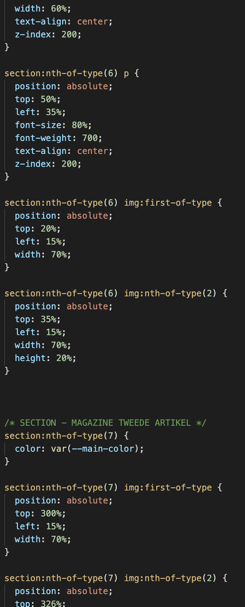

# Procesverslag
Markdown is een simpele manier om HTML te schrijven.  
Markdown cheat cheet: [Hulp bij het schrijven van Markdown](https://github.com/adam-p/markdown-here/wiki/Markdown-Cheatsheet).

Nb. De standaardstructuur en de spartaanse opmaak van de README.md zijn helemaal prima. Het gaat om de inhoud van je procesverslag. Besteedt de tijd voor pracht en praal aan je website.

Nb. Door *open* toe te voegen aan een *details* element kun je deze standaard open zetten. Fijn om dat steeds voor de relevante stuk(ken) te doen.

## Jij

  
uitwerken voor kick-off werkgroep

  ### Auteur:
  Tabita Krommenhoek

  #### Je startniveau:
  Blauwe piste.

  #### Je focus:
  surface plane (BlingBling)
 

## Je website

  
uitwerken voor kick-off werkgroep

  ### Je opdracht:
  Ik ga de H&M website maken https://www2.hm.com/nl_nl/index.html 

  #### Screenshot(s) van de eerste pagina (small screen): 
  Homepage 
  
 

  #### Screenshot(s) van de tweede pagina (small screen):
  Detailpagina 
  
 

## Toegankelijkheidstest 1/2 (week 1)

  
uitwerken na test in 1e werkgroep

  ### Bevindingen
  Lijst met je bevindingen die in de test naar voren kwamen:

  #### Screenreader
  Bij de screenreader merkte ik dat:
  1. de reader niet alle labels voorleest die belangrijk zijn.
  2. hij bijvoorbeeld de prijs vertelt maar niet omschrijft waar hij de prijs van vertelt
  3. zegt vaak "link" voordat hij het woord voorleest.
  4. de pijltjes links en rechts leest hij woorden letter voor letter uit.

  Hier een omschrijving van hoe het opgelost kan worden (met indien nodig afbeeldingen)

  #### Muis en Toetsenbord 
  bij de shift knop methode:
  1. slaat hij soms buttons over 
  2. de enter knop werkte goed
  3. de shift knop gaat op alle labels die niet belangrijk zijn voor als je kleding bestelt.

  Hier een omschrijving van hoe het opgelost kan worden (met indien nodig afbeeldingen)

  #### Motoriek (shocks, elastiekjes)
  Bij de parkinson band merkte ik dat:
  1. ik niet klikte op de dingen die ik wilde selecteren
  2. dat de buttons over het algemeen groter moeten
  3. dat het voor radio buttens handig is dat de labels klikbaar zijn, anders is de taak echt onmogelijk om uit te voeren 
  4. je meer spacing moet gebruiken om fouten te  voorkomen

  Bij de elastiekjes merkte ik dat:
  1. het moeilijk was om je telefoon vast te houden
  2. dat je vaak dingen aanklikte die je niet wilde selecteren
  3. het moeilijker is om kleine buttons aan te klikken
  4. er grotere knoppen moeten komen
  5. en de dingen verder uit elkaar moeten

  #### Visueel (brillen, contrast, kleurenblind, dark/light). 
 Bij visueel merke ik dat:
 1. kleine tekst gewoon niet te lezen is als je slechtziend bent
 2. lange teksten uitputtend zijn om te lezen
 3. dat je grotere plaatjes nodig hebt
 4. dat er een duidelijk contrast moet zijn tussen de kleuren omdat het anders niet opvalt.
  Hier een omschrijving van hoe het opgelost kan worden (met indien nodig afbeeldingen)

## Breakdownschets (week 1)

  
uitwerken na afloop 2e werkgroep

  ### de hele pagina: 
  

  ### dynamisch deel (bijv menu): 
  

  

## Voortgang 1 (week 2)

  
uitwerken voor 1e voortgang

  ### Stand van zaken
  Ik begon met het menu, dat ging nog redelijk goed. het was voornamelijk een beetje trial en error nog met flexbox omdat ik er weer even in moest komen. het hamburger menu heb ik besloten om even te laten gaan en dan kom ik daarop terug tegen het einde aan. ik wilde voor nu zo veel mogelijk content van de pagina af hebben.

  ik ben met het eerste blok begonnen van de pagina. in de eerste instantie had ik voor het beige blokje een image gebruikt en probeerde ik het met position absolute en relative een beetje bij elkaar te krijgen.

  dit was hoe het eruit zag met de bijbehorende code. dit ging dus niet helemaal zoals ik wilde maar vervolgens heb ik het hier dus mee gedaan om het goed te krijgen. ik wist niet of dit de juiste manier was dus dit was een onderdeel waar ik nog vragen voor had bij de voortgangsgesprekken.

   
    

Nadat ik het beige blokje heb opgelost ben ik verder gegaan met het stuk eronder voor het grijstinten gedeelte. ik heb eigenlijk hier weer position absolute en relative gebruikt. dus nogmaals wist ik niet of dit de juiste methode was.

na het de eerste 2 sections van de main ben ik begonnen aan de slider. dit was nog best een uitdaging omdat ik nog neit eerder met een slide heb gewerkt. ik ben als eerst begonnen met mijn html erin te zetten en een klein beetje css gebruikt om de images te schalen zodat ik een beetje overzicht had. 

 

 vervolgens besloot ik om de elementen met flexbox eerst naast elkaar te krijgen voordat ik de slider ging maken. hier kwam ik nogal tegen wat kleine probleempjes aan wat best frustrerend was. hier heb ik nog wat foto's van wat dingen die ik heb geprobeerd met de code.

 
  

Na heel veel trial en error proberen en te spelen met code ben ik hier gekomen.
 
  

zoald je op de afbeelding hierboven ziet gaat het nog steeds niet helemaal goed na wat spelen heb ik het goed gekregen alleen kwam ik er wel achter dat ik de content in een div moest zetten en moest omdraaien omdat ik gebruik moest maken van column-reverse. toen stond alles goed en heb ik met overflow-x:auto de code slider goed gekregen.

  ### Agenda voor meeting
  samen met je groepje opstellen
   ik ken de mensen niet met wie ik de bespreking heb dus ik heb voor mezelf opgeschreven wat ik wilde vragen.

Tabita      
  | ---            
  | Ik wil vragen of mijn disneyblok goed is en mijn eerste blok van grijstinten. 
  | ik wil eten of mijn slider goed staat
  | ik wil vragen hoe ik het MAGAZINE gedeelte met die achtergrond zo kan krijgen. 
  | ik wil ook nog vragen hoe ik een font kan gebruiken in mijn bestand want dar ging niet helemaal goed
  | ik wil ook weten hoe ik mijn menu balk vast krijg want met position sticky lukt het niet

  ### Verslag van meeting
  hier na afloop snel de uitkomsten van de meeting vastleggen

  - De student assistent heeft mij uitgelegd dat ik voor het disneyblok geen image hoef te gebruiken maar de content in een div kan zetten en dan de div een background color kan geven. dan hoef ik ook niet de content met z-index naar voren te krijgen etc.

  - Mijn slider is goedgekeurd door de student assistent. ik heb uitgelegd wat ik heb gedaan en de feedback daarop was positief.

  - voor het MAGAZINE gedeelte kreeg ik dezelfde feedback als op mijn eerste punt alleen dit keer kon ik dus de background image beter op de article zetten zodat het met de styling ook goed gaat.

  - voor het importeren van een font heeft de student assistent mij verwezen naar w3c.schools, ik legde uit dat ik dat al een keer geprobeerd had en het niet werkte. vervolgens zei de student assistent dat ik het font ook in mijn assets moet zetten en dat was mijn fout waardoor het font niet werkte.

  - de student assistent gaf aan dat als ik het een background kleur geef en vervolgens position fixed dat het moet werken en dat is ook gelukt toen.

## Voortgang 2 (week 3)

  
uitwerken voor 2e voortgang

  ### Stand van zaken
  ik heb deze week mijn "H&M home" colum gemaakt dat ging mij deze week erg makkelijk af omdat die bijna hetzelfde in elkaar zit als de "grijstinten" blok. 

  vervolgens ben ik verder gegaan met het stylen van mijn magazine blokken. dit deed ik met position absolute en relative. ik had al een voorgevoel dat dit niet helemaal de juiste manier zou zijn maar ik besloot het voor nu zo te doen omdat ik even vast liep en niet meer wist hoe ik dit moest oplossen. het kwam ook omdat ik al een aantal uren bezig was met code dus ik was ook al moe toen ik hier aan begon.

 
  

  verder heb ik deze ook nog mijn hamburger menu gemaakt. ik begon met de html code. en het hamburger icoontje heb ik gemaakt in adobe XD.
 

 verder ben ik niet gekomen deze week omdat ik ook een tentamen had waar ik voor moest leren.

  ### Agenda voor meeting
  samen met je groepje opstellen
  ik ken de mensen niet met wie ik de bespreking heb dus ik heb voor mezelf opgeschreven wat ik wilde vragen.

  | Tabita      
  | ---            
  | mijn enige vraag voor deze week is hoe ik mijn magazine sections makkelijker kan oplossen in plaats van alles met left en right te positioneren.
          

  ### Verslag van meeting
  hier na afloop snel de uitkomsten van de meeting vastleggen

  - Vasilis gaf aan dat ik met flexbox dit heel makkelijk kan oplossen en ik had er niet bij nagedacht om dit eerder te gebruiken. echt dom... tijdens de voortgang heb ik mijn code meteen aangepast en had ik het binnen de tijd van de voorgang nog helemaal af gekregen.

 
  

  - verder kreeg ik nog een goeie tip om dingen met margin-top een ruimte te geven dus daar ben ik vanaf dit punt ook meer gebruik van gaan maken.
 

## Toegankelijkheidstest 2/2 (week 4)

  
uitwerken na test in 8e werkgroep

  ### Bevindingen
  Lijst met je bevindingen die in de test naar voren kwamen (geef ook aan wat er verbeterd is):

  #### Screenreader
  Hier korte omschrijving (met indien nodig afbeeldingen)

  Hier een omschrijving van hoe het opgelost kan worden (met indien nodig afbeeldingen)

  #### Muis en Toetsenbord 
  Hier korte omschrijving (met indien nodig afbeeldingen)

  Hier een omschrijving van hoe het opgelost kan worden (met indien nodig afbeeldingen)

  #### Motoriek (shocks, elastiekjes)
  Motoriek:
  Artikelen zijn groot genoeg om op te klikken met trillende arm. Alleen zijn de meeste artikelen nog geen links en nog niet tab-baar omdat ze geen link zijn. Voor eindoplevering moet ik nog van al die artikelen een <a> maken zodat je ze met tab kan focussen. 

  ik heb ook gedaan dat je op de plaatjes kan klikken want op de echte h&M website kan je alleen op de titels klikken en dat was dus een ding dat ik heb opgelost

  #### Visueel (brillen, contrast, kleurenblind, dark/light). 
 Brillen:
Stip in midden:
Homepagina: goed te doen, nergens last, misschien voor darkmode wel nog een goed idee om de tekst niet zo donker rood te maken omdat het een beetje weg valt. dus die juist nog wat lichter maken
2de pagina: ook prima te doen

Vlekken/wolkjes:
Homepagina: ondertekst van rode header niet helemaal leesbaar door grootte (te klein), zelfde geldt voor de ’read story’ teksten, dus voor dit onderdeel kan ik nog de tekst wat groter maken
2de pagina: product info nauwelijks te lezen, breadcrumbs (Hm.com/dames/etc.) niet te lezen, maar dat hoeft ook niet per se want het is niet echt belangrijk daarom is de tekst ook erg klein.

Halve zichtbaarheid:
Homepagina: nergens last van als je je hoofd een beetje draait.
2de pagina: zelfde geldt voor deze pagina

Gele bril:
Homepagina: nergens last van, overal goed genoeg contrast
2de pagina: zelfde geldt voor deze pagina

## Voortgang 3 (week 4)

  
uitwerken voor 3e voortgang

  ### Stand van zaken
  ik begon een beetje stress te krijgen omdat ik dus dacht dat ik hierna nog een week had, maar dat had ik even fout berekend dus ik besefte dat ik opeens nog best veel moest doen, daarom heb ik deze week wat minder dingen vastegelegd qua voorgang omdat ik echt moest doorwerken. 
  
  na mijn tentamen heb ik mijn menu met javascript erin gekregen en ben ik hem gaan stylen. in de les. hierbij heb  ik nog wat hulp gekregen van de student assistentes dus die had ik aan het einde van de les af.

  daarna ben ik snel begonnen aan mijn 2e pagina in elkaar zetten met html en heb ik beide pagina's een class gegeven zodat ik kon beginnen met het stylen van de pagina.

ik had wat problemen met de kleine afbeeldingen omdat het in 1 section stond dus als ik deze images stylden dan ging de grote image erboven ook mee en ik kreeg ze dus niet zo goed naast elkaar

 

 ik heb dit probleem uiteindelijk opgelost door deze 2 afbeeldingen in een lijstje te zetten zodat ik die apart kon aanspreken. verder ging het erg vlot met de styling van mijn 2e pagina.

 ik heb nog een onderste balk die vast moet staan op mijn pagina. in de eerste instantie dacht ik okey dit wordt moeilijk en toen ik goed ging kijken naar mijn code kwam ik erachter dat ik dezelfde styling kon gebruiken als mijn header want daar heb ik ook een balk natuurlijk.

  ### Agenda voor meeting
  samen met je groepje opstellen

  | Tabita      
  | ---            
  | ik wil vragen of mijn section met alle afbeeldingen bij elkaar wel op de juiste manier is gedaan omdat ik nogal maar wat geprobeerd heb en meestal is dat niet meteen de goeie manier  
  | Ik wil ook nog even advies krijgen over de 5 functies die ik in mijn code wil stoppen omdat ik daar nog niet aan begonnn ben behalve met light/dark mode
            

  ### Verslag van meeting
  hier na afloop snel de uitkomsten van de meeting vastleggen

  - mijn afbeeldingen was op een betere manier op te lossen dan die ik heb gebruikt. ik had display flex gebruikt maar display grid was beter in dit geval. de student assistent heeft mij de manier laten zien waarmee hij elke derde image de volledige breedte geeft en de 2 andere images dus in het grid naast elkaar plaatst.

  - verder kreeg ik nog wat tips voor mijn 5 functies. zo heb ik een video toegevoegd tijdens de bespreking en mijn light/dark mode verder gemaakt. Na de les ga ik nog de laatste dingen voor mijn site in orde maken.
 

## Eindgesprek (week 5)

  
uitwerken voor eindgesprek

  ### Je uitkomst - karakteristiek screenshots:
  

  ### Dit ging goed/Heb ik geleerd: 
  Korte omschrijving met plaatjes

  

  ### Dit was lastig/Is niet gelukt:
  Korte omschrijving met plaatjes

  

## Bronnenlijst

  
continu bijhouden terwijl je werkt

  Nb. Wees specifiek ('css-tricks' als bron is bijv. niet specifiek genoeg).

  1. https://css-tricks.com/snippets/sass/black-white-opacity-mixins/ 
  2. https://css-tricks.com/snippets/css/a-guide-to-flexbox/ 
  3. https://flexboxfroggy.com/#nl 
  4. https://www.w3schools.com/css/css_font.asp 
  5. https://www.w3schools.com/howto/howto_js_slideshow.asp 
  6. https://www.w3schools.com/howto/howto_js_mobile_navbar.asp 
  7. https://www.voicy.network/search?search=horn%20sound 

